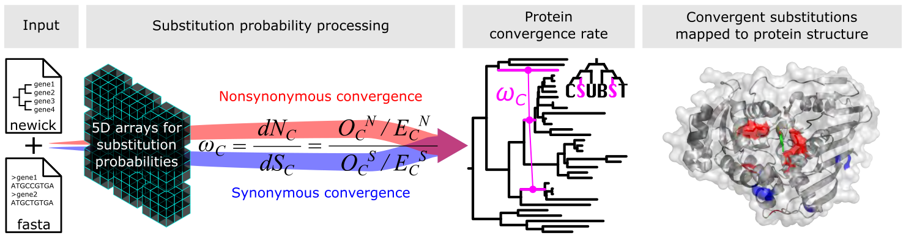

[](https://github.com/kfuku52/csubst/actions/workflows/pytest.yml)
[](https://github.com/kfuku52/csubst/releases)
[](https://anaconda.org/bioconda/csubst)
[](https://github.com/kfuku52/csubst)
[](https://anaconda.org/bioconda/csubst)
[](https://anaconda.org/bioconda/csubst)
[](https://opensource.org/licenses/MIT)

## Overview
**CSUBST** ([/si:sʌbst/](http://ipa-reader.xyz/?text=si:s%CA%8Cbst&voice=Salli)) is a tool for analyzing **C**ombinatorial **SUBST**itutions of codon sequences in phylogenetic trees.
A combinatorial substitution is defined as recurrent substitutions that occur at the same protein site in multiple independent branches.
If multiple substitutions result in the same amino acid, they are considered convergent amino acid substitutions.
The main features of **CSUBST** include:

- Error-corrected rate of protein convergence with null expectation obtained by:
    - Empirical or mechanistic codon substitution model
    - Urn sampling from site-wise substitution frequencies (**experimental**)
- Flexible specification of "foreground" lineages and its comparison with neighboring branches
- Heuristic detection of higher-order convergence involving more than two branches
- Simulated sequence evolution under specified scenarios of convergent evolution
- Convergent substitution mapping to protein structure



## Input files
**CSUBST** takes as inputs: 
- [Newick](https://en.wikipedia.org/wiki/Newick_format) file for the rooted tree
- [FASTA](https://en.wikipedia.org/wiki/FASTA_format) file for the multiple sequence alignment of in-frame coding sequences

## Installation
**CSUBST** runs on python 3. Installation via [bioconda](https://anaconda.org/bioconda/csubst) is recommended for ease of use, as it handles all dependencies automatically. `pip` installation is also supported, but in this case [IQ-TREE](https://iqtree.github.io/) and a few python packages must be installed separately.

IQ-TREE compatibility: CSUBST supports IQ-TREE 2.x and 3.x outputs. For some IQ-TREE 3 codon runs where `.iqtree` does not print codon `pi(...)` entries, CSUBST estimates empirical codon frequencies directly from the input alignment.

#### Option 1: Installation with `conda`
```
conda install bioconda::csubst
```

#### Option 2: Installation with `pip`
```
# IQ-TREE should be installed separately: https://iqtree.github.io/
pip install numpy cython # NumPy and Cython should be available upon csubst installation
pip install git+https://github.com/kfuku52/csubst
```

## Test run
```
# Generate a test dataset
csubst dataset --name PGK

# Run csubst analyze
csubst analyze --alignment_file alignment.fa --rooted_tree_file tree.nwk --foreground foreground.txt
```

## Usage
CSUBST provides four main subcommands:

- `csubst dataset`: generate bundled example datasets (e.g., `PGK`, `PEPC`).
- `csubst analyze`: run convergence analysis and output metrics such as `omegaC`, `dNC`, and `dSC`.
- `csubst site`: compute site-wise combinatorial substitutions for selected branch combinations, generate tree + site summary plots, and optionally map sites to protein structures.
- `csubst simulate`: simulate codon sequence evolution under user-defined convergent scenarios.

Get available commands and options:

```bash
csubst -h
csubst SUBCOMMAND -h
```

Typical workflow:

```bash
# 1) Prepare a toy dataset
csubst dataset --name PGK

# 2) Run convergence analysis
csubst analyze \
  --alignment_file alignment.fa \
  --rooted_tree_file tree.nwk \
  --foreground foreground.txt

# 3) Inspect site-wise convergence for a branch pair (example)
csubst site \
  --alignment_file alignment.fa \
  --rooted_tree_file tree.nwk \
  --branch_id 23,51
```

For advanced settings (foreground formats, higher-order search, structure mapping, simulation parameters), see the [CSUBST Wiki](https://github.com/kfuku52/csubst/wiki).

## Citation
Fukushima K, Pollock DD. 2023. Detecting macroevolutionary genotype-phenotype associations using error-corrected rates of protein convergence. Nature Ecology & Evolution 7: 155–170. [DOI: 10.1038/s41559-022-01932-7](https://doi.org/10.1038/s41559-022-01932-7)

## Licensing
**CSUBST** is MIT-licensed. See [LICENSE](LICENSE) for details.
