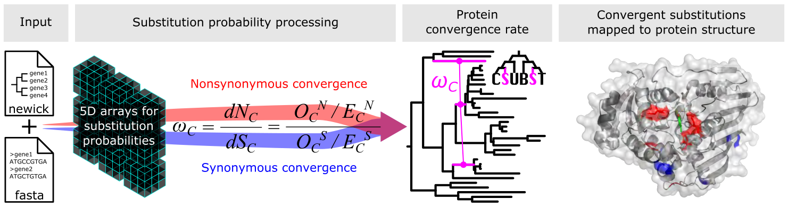

[](https://github.com/kfuku52/csubst/actions/workflows/pytest.yml)
[](https://github.com/kfuku52/csubst/releases)
[](https://anaconda.org/bioconda/csubst)
[](https://github.com/kfuku52/csubst)
[](https://anaconda.org/bioconda/csubst)
[](https://anaconda.org/bioconda/csubst)
[](https://opensource.org/licenses/MIT)

## Overview
**CSUBST** ([/si:sʌbst/](http://ipa-reader.xyz/?text=si:s%CA%8Cbst&voice=Salli)) is a tool for analyzing **C**ombinatorial **SUBST**itutions in codon sequences on phylogenetic trees.
A combinatorial substitution is a recurrent substitution at the same protein site on multiple independent branches.
When independent substitutions lead to the same amino acid, they are interpreted as convergent amino acid substitutions.
The main features of **CSUBST** are:

- Error-corrected rates of protein convergence, with null expectations based on:
    - Empirical or mechanistic codon substitution models
    - Urn sampling from site-wise substitution frequencies (**experimental**)
- Flexible specification of "foreground" lineages and comparisons with neighboring branches
- Heuristic detection of higher-order convergence involving more than two branches
- Sequence simulation under user-defined scenarios of convergent evolution
- Mapping convergent substitutions onto protein structures



## Input files
**CSUBST** requires the following input files:

- A [Newick](https://en.wikipedia.org/wiki/Newick_format) file containing the rooted tree
- A [FASTA](https://en.wikipedia.org/wiki/FASTA_format) file containing a multiple sequence alignment of in-frame coding sequences

## Installation
**CSUBST** runs on Python 3. Installation via [Bioconda](https://anaconda.org/bioconda/csubst) is recommended because it installs the required dependencies automatically. `pip` installation is also supported, but [IQ-TREE](https://iqtree.github.io/) and several Python packages must then be installed separately.

#### Option 1: Install with `conda`
```
conda install bioconda::csubst
```

#### Option 2: Install with `pip`
```
# Install IQ-TREE separately: https://iqtree.github.io/
pip install git+https://github.com/kfuku52/csubst
```

## Test run
```
# Generate a test dataset
csubst dataset --name PGK

# Run csubst search
csubst search --alignment_file alignment.fa.gz --rooted_tree_file tree.nwk --foreground foreground.txt
```

## Usage
CSUBST provides eight main subcommands:

- [`csubst dataset`](https://github.com/kfuku52/csubst/wiki/csubst-dataset): generate built-in example datasets such as `PGK` and `PEPC`.
- [`csubst doctor`](https://github.com/kfuku52/csubst/wiki/csubst-doctor): validate input files, inferred IQ-TREE paths, and optional 3Di settings before longer runs.
- [`csubst search`](https://github.com/kfuku52/csubst/wiki/csubst-search) (legacy alias: `csubst analyze`): run convergence analysis and report metrics such as `omegaC`, `dNC`, and `dSC`.
- [`csubst inspect`](https://github.com/kfuku52/csubst/wiki/csubst-inspect): summarize branch mappings and inspect ancestral states.
- [`csubst sites`](https://github.com/kfuku52/csubst/wiki/csubst-sites) (legacy alias: `csubst site`): compute site-wise combinatorial substitutions for selected branch combinations, generate tree and site-summary plots, and optionally map sites to protein structures.
- [`csubst simulate`](https://github.com/kfuku52/csubst/wiki/csubst-simulate): simulate codon sequence evolution under user-defined convergence scenarios.
- [`csubst benchmark`](https://github.com/kfuku52/csubst/wiki/csubst-benchmark): run `csubst search` over parameter grids on the same input data and summarize runtime and output metrics.
- [`csubst benchmark-plot`](https://github.com/kfuku52/csubst/wiki/csubst-benchmark-plot): collect existing benchmark outputs, compare performance across parameter settings, and write an overview figure.

Display available commands and options:

```bash
csubst -h
csubst SUBCOMMAND -h
```

Typical workflow:

```bash
# 1) Prepare a toy dataset
csubst dataset --name PGK

# 2) Validate inputs and inferred IQ-TREE paths
csubst doctor \
  --alignment_file alignment.fa.gz \
  --rooted_tree_file tree.nwk \
  --foreground foreground.txt

# 3) Run convergence analysis
csubst search \
  --alignment_file alignment.fa.gz \
  --rooted_tree_file tree.nwk \
  --foreground foreground.txt

# 4) Inspect site-wise convergence for a branch pair
csubst sites \
  --alignment_file alignment.fa.gz \
  --rooted_tree_file tree.nwk \
  --branch_id 23,51
```

For advanced settings, including foreground formats, higher-order search, structure mapping, and simulation parameters, see the [CSUBST Wiki](https://github.com/kfuku52/csubst/wiki).

## Citation
Fukushima K, Pollock DD. 2023. Detecting macroevolutionary genotype-phenotype associations using error-corrected rates of protein convergence. Nature Ecology & Evolution 7: 155–170. [DOI: 10.1038/s41559-022-01932-7](https://doi.org/10.1038/s41559-022-01932-7)

## Licensing
**CSUBST** is MIT-licensed. See [LICENSE](LICENSE) for details.
