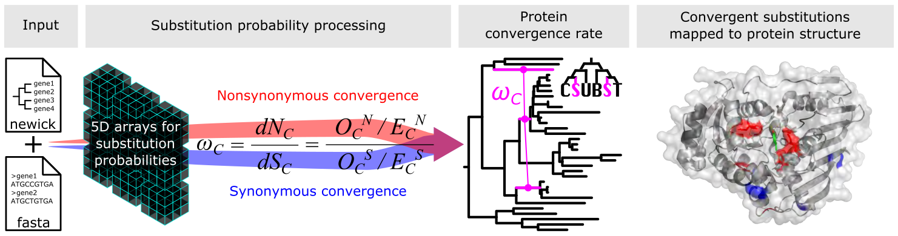

[](https://github.com/kfuku52/csubst/actions/workflows/pytest.yml)
[](https://github.com/kfuku52/csubst/releases)
[](https://anaconda.org/bioconda/csubst)
[](https://github.com/kfuku52/csubst)
[](https://anaconda.org/bioconda/csubst)
[](https://anaconda.org/bioconda/csubst)
[](https://opensource.org/licenses/MIT)

## Overview
**CSUBST** (/si:sʌbst/) is a tool for analyzing **C**ombinatorial **SUBST**itutions in codon sequences on phylogenetic trees.
A combinatorial substitution is a recurrent substitution at the same protein site on multiple independent branches.
When independent substitutions lead to the same amino acid, they are interpreted as convergent amino acid substitutions.
The main features of **CSUBST** are:

- Error-corrected rates of protein convergence, with null expectations based on:
    - Empirical or mechanistic codon substitution models
    - Urn sampling from site-wise substitution frequencies (**experimental**)
- Flexible specification of "foreground" lineages and comparisons with neighboring branches
- Heuristic detection of higher-order convergence involving more than two branches
- Sequence simulation under user-defined scenarios of convergent evolution
- Mapping convergent substitutions onto protein structures



## Input files
**CSUBST** requires the following input files:

- A [Newick](https://en.wikipedia.org/wiki/Newick_format) file containing the rooted tree
- A [FASTA](https://en.wikipedia.org/wiki/FASTA_format) file containing a multiple sequence alignment of in-frame coding sequences

## Installation
**CSUBST** supports Python 3.10–3.14. Installation via [Bioconda](https://anaconda.org/bioconda/csubst) is recommended because it installs IQ-TREE and the required Python dependencies automatically. `pip` installs the core Python dependencies automatically, but [IQ-TREE](https://iqtree.github.io/) and a C compiler must be available separately.

Bioconda builds can lag behind source support. For Python 3.14, use the GitHub
source route below until a compatible Bioconda build is available. See the
[installation guide](https://github.com/kfuku52/csubst/wiki/Installation-and-test-run)
for the checked distribution versions and Python ranges.

#### Option 1: Install with `conda`
```
conda install bioconda::csubst
```

#### Option 2: Install with `pip`
```
# Install IQ-TREE separately: https://iqtree.github.io/
python -m pip install git+https://github.com/kfuku52/csubst
```

Protein-structure mapping additionally requires PyMOL and MAFFT. PyMOL can be
installed with the `structure` extra; install the MAFFT executable separately:

```bash
python -m pip install "csubst[structure] @ git+https://github.com/kfuku52/csubst"
```

VESM and other protein-language-model features use the optional `vep` extra:

```bash
python -m pip install "csubst[vep] @ git+https://github.com/kfuku52/csubst"
```

## Test run

Run these commands in an empty working directory:

```
# Generate a test dataset
csubst dataset --name PGK

# Run csubst search
csubst search --alignment_file alignment.fa.gz --rooted_tree_file tree.nwk --foreground foreground.txt
```

## Usage
CSUBST provides ten main subcommands:

- [`csubst dataset`](https://github.com/kfuku52/csubst/wiki/csubst-dataset): generate built-in example datasets such as `PGK` and `PEPC`.
- [`csubst download`](https://github.com/kfuku52/csubst/wiki/csubst-download): prepare model resources without an input alignment; VESM files are always SHA-256 checked.
- [`csubst doctor`](https://github.com/kfuku52/csubst/wiki/csubst-doctor): validate input files, inferred IQ-TREE paths, and optional 3Di settings before longer runs.
- [`csubst search`](https://github.com/kfuku52/csubst/wiki/csubst-search) (legacy alias: `csubst analyze`): run convergence analysis and report metrics such as `omegaC`, `dNC`, and `dSC`.
- [`csubst scan`](https://github.com/kfuku52/csubst/wiki/csubst-scan): find foreground recurrent amino-acid/state substitutions and compare foreground and control rates.
- [`csubst inspect`](https://github.com/kfuku52/csubst/wiki/csubst-inspect): summarize branch mappings, inspect ancestral states, and report exact topology-derived independent branch-combination counts without enumerating combinations.
- [`csubst sites`](https://github.com/kfuku52/csubst/wiki/csubst-sites) (legacy alias: `csubst site`): compute site-wise combinatorial substitutions for selected branch combinations, generate tree and site-summary plots, and optionally map sites to protein structures.
- [`csubst simulate`](https://github.com/kfuku52/csubst/wiki/csubst-simulate): simulate codon sequence evolution under user-defined convergence scenarios.
- [`csubst benchmark`](https://github.com/kfuku52/csubst/wiki/csubst-benchmark): run `csubst search` over parameter grids on the same input data and summarize runtime and output metrics.
- [`csubst benchmark-plot`](https://github.com/kfuku52/csubst/wiki/csubst-benchmark-plot): collect existing benchmark outputs, compare performance across parameter settings, and write an overview figure.

Display commands and options:

```bash
csubst -h
csubst SUBCOMMAND -h
csubst SUBCOMMAND --help-advanced
```

`--threads` controls CSUBST task/process parallelism; `--blas_threads` limits
native BLAS/OpenMP work separately (default 1). Analysis commands support
`--outdir`, `--output_prefix`, and `--log_file`. For a complete example, see the
[typical workflow](https://github.com/kfuku52/csubst/wiki/Typical-workflow).

<a id="vesm-35m-variant-effect-scores-in-csubst-sites"></a>

Shared models can be prepared before running an offline or batch job:

```bash
csubst download --resource vesm-35m
csubst download --resource vesm-35m --no_download yes
```

VESM files and structure downloads use the CSUBST cache (default
`~/.cache/csubst`, overridable with `CSUBST_CACHE_DIR`). ProstT5 weights use
Hugging Face's cache or `--prostt5_local_dir`, independently of that setting.
See [model caches and offline use](https://github.com/kfuku52/csubst/wiki/csubst-download)
and [VESM-35M scoring](https://github.com/kfuku52/csubst/wiki/csubst-sites#vesm-35m-variant-effect-scoring).

Foreground formats, higher-order search, site outputs, structure mapping, and
simulation guides are available in the [Wiki](https://github.com/kfuku52/csubst/wiki).
Developer setup and checks are documented in [CONTRIBUTING.md](CONTRIBUTING.md),
[docs/ARCHITECTURE.md](docs/ARCHITECTURE.md), and [TESTING.md](TESTING.md).

## Citation
Fukushima K, Pollock DD. 2023. Detecting macroevolutionary genotype-phenotype associations using error-corrected rates of protein convergence. Nature Ecology & Evolution 7: 155–170. [DOI: 10.1038/s41559-022-01932-7](https://doi.org/10.1038/s41559-022-01932-7)

## Licensing
**CSUBST** is MIT-licensed. See [LICENSE](LICENSE) for details.
