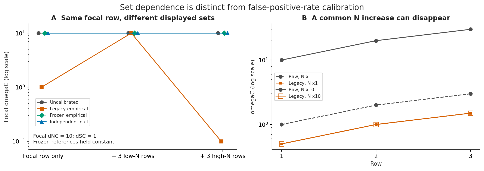
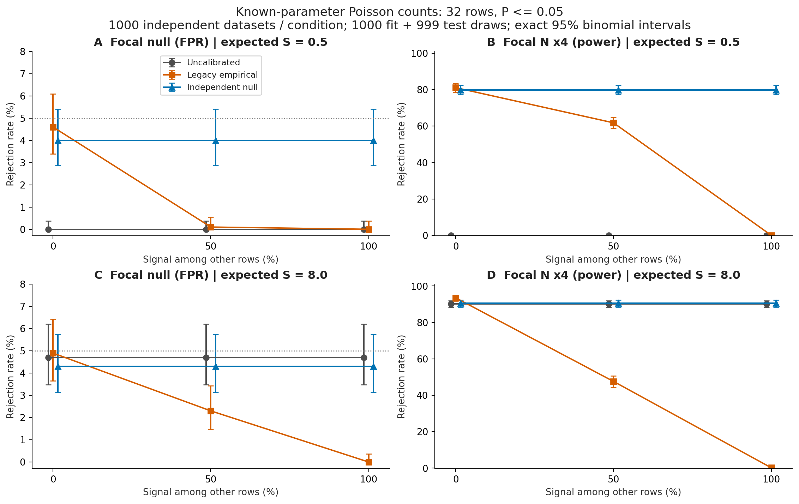
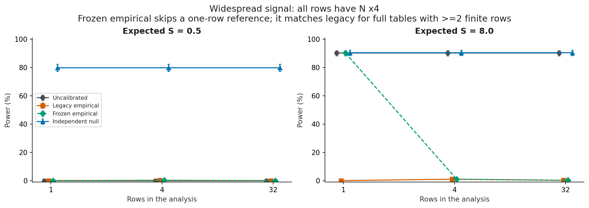

# ID 10：long-tail補正の実装と比較

2026-09-10。基点は `dd37bee67b39199a1920600cf00c0ecb8566f477`。
以下は初回実装時の実験記録。実験当時は作業用worktree内で検証し、
その後、本体へ統合した。既定方式の変更と追加検証は
[統合時の検証記録](INTEGRATION_VALIDATION.md)を参照。

## 結果

**参照集合の固定は、表示・不足行バッチによる変動を解消する。一方、
参照集合に真の信号が広く存在するときの経験的補正の情報消失は残る。**
独立に生成した較正用nullから固定した変換を作る方式を追加し、両者を区別した。



左図では対象のdNC=10、dSC=1を固定。旧方式は同時に含める行によって
omegaCが1、10、0.1に変わる。固定経験的参照と独立null参照は、それぞれの
参照を保持したまま表示集合を変更している。新しい完全解析で経験的参照を
再推定した場合まで同値になるという図ではない。
右図は、集合全体のNを10倍にしても旧補正後omegaCが同一になる例。
この図自体はP値・検出力を測定していない。



32行、既知のE_N=8、E_S=0.5または8。対象以外の行のN増加の割合を変え、
対象行が帰無の場合とNが4倍の場合を分けて測定した。
各条件1,000独立データセット、較正用1,000回、検定用999回、P≤0.05。
誤差棒はClopper–Pearsonの95%二項信頼区間。
方式間・条件間では対象の観測と検定乱数を共有しており、異なる条件を合算して
独立反復数を増やせる設計ではない。

| E_S | 対象以外の信号 | 旧経験的補正の検出力 | 独立null方式の検出力 | 無補正の検出力 |
|---:|---:|---:|---:|---:|
| 0.5 | 0% | 81.1% | 79.9% | 0.0% |
| 0.5 | 100% | 0.0% | 79.9% | 0.0% |
| 8 | 0% | 93.5% | 90.5% | 90.2% |
| 8 | 100% | 0.2% | 90.5% | 90.2% |

独立null方式の偽陽性率は、E_S=0.5で4.0%（95%区間2.87–5.41%）、
E_S=8で4.3%（3.13–5.75%）。これらの値は対象以外の信号の有無と行数を
変更しても同一だった。旧方式でも対象以外がすべて帰無なら偽陽性率は
4.6%、4.9%だった。したがって「旧方式は一般に偽陽性を作る」または
「新方式が常に高い検出力を持つ」という結論ではない。

E_S=0.5の無補正では、S=0による無限大のomegaCが帰無にも高頻度で現れ、
有限値の極端さを評価できず、今回のP≤0.05で棄却されなかった。
分母の補正とそれに対応する帰無変換は、この統計量の違いも生む。



新しい固定経験的方式は有限参照が1行しかなければ補正を停止する。
2行以上の完全な参照集合に適用する場合は旧経験的方式と同じ計算であり、
広範な信号の抑制までは解消しない。

## 実装

- [longtail.py](../../csubst/longtail.py)：S値とmidrank、Nの分位点を共に保持する
  `QuantileMap`。fit/applyを分離し、変換のSHA-256、有限ペア数、同順位診断を保持。
- [omega_calibration.py](../../csubst/omega_calibration.py)：経験的参照の保持、
  枝組合せ・カテゴリ別の独立null較正、目的別乱数、観測／検定の同一変換。
  独立nullは各行を処理するので較正サンプルを全行分同時に保持しない。
- `omega.py`、`omega_statistics.py`：観測・P値の呼出し接続、
  有限参照0・1行の停止、実際に分母が増加した行のみを計数。
- `main_analyze.py`、`foreground.py`：同じ参照の再利用。
  不足行だけで新しい経験分布を作る処理を廃止。
- CLI、設定検証、型定義、列フィルタ、ドキュメントも更新。
  `--calibrate_longtail` の既定は `no`。
  `yes --longtail_method empirical` で経験的感度分析を選べる。
  新方式は `yes --longtail_method independent_null`。

独立nullは既存のhypergeom、poisson、poisson_full、固定alphaのnbinomを利用する。
乱数の独立性は較正用と検定用の間の独立性であり、観測から推定されたモデルや
期待値まで独立とは呼ばない。各行のECN/ECSに条件付けて、各行固有の参照を作る。

未補正のdSC・omegaC・P/Qを併記し、補正後のP/Qを再計算する。
`_nocalib` はlong-tail前を意味し、擬似カウント前とは限らない。
有限参照数、ユニークS数、参照ハッシュ、母集団ハッシュ、適用／停止理由、
実際の分母増加、seed、有効／未定義の検定反復数をカテゴリ別に記録する。

不足行だけの経路では、経験的補正の全母集団nullが存在しないため、
較正後P/QをNaNとし理由を明示する。独立nullでは行別のPを再計算できるが、
不完全な検定ファミリーから算出したQを元のQへ混ぜないためQはNaNとする。

## 検証範囲と依存関係

- 固定参照の部分集合、行順、同順位、0・1有限行、非有限値、
  分母増加の計数、未補正P/Q保存、未対応設定の拒否を検証。
- 同一の観測／帰無カウントでP=1を確認。
- 独立nullの行追加・削除・順序、目的別乱数、単段／多段の最終反復数、
  検定統計量のブロックサイズ変更に対する同値性を検証。
- 実際の4種類のカウント生成器、全4 baseカテゴリ、uniform／N・S別の
  サイト重み経路で、補正・P値・行抽出の同値性を検証。
- 3Di修正を含む元タスクの変更とは、一時コピー上で競合なく三者マージできた。
  元ディレクトリへの変更はしていない。

擬似カウントの共通変換（ID2）、共同dif帰無生成（ID4）は元タスク担当。
新方式との非ゼロ擬似カウント／dif併用は、未検証の代替計算で通さず明示的に拒否する。
自動nbinom分散も新方式では未対応。従来P値のID2・ID4の問題をこの変更で解消したとは扱わない。
3DiのS側比較には引き続き未補正列を使う。公開Q.3Di追加は行っていない。

今回の偽陽性率・検出力は**既知パラメータのPoissonカウントモデル限定**。
樹上の配列生成、ASR、モデル再推定、枝共有、前景探索・高arity候補選択まで含む
全解析のFPR/FWER保証ではない。ASRV・null_model全種類での科学的較正評価は今後の課題。
新方式は実験的な選択肢として提供し、既定にはしていない。

## 実行したチェック

- 現行worktree：`python -m pytest -q` **1,575 passed / 3 skipped**。
  3件はPyTorch 2.6以上を要するテストで、この環境は2.2.2。
- `make lint typecheck` と `git diff --check` 成功。
  新しい2モジュールもMakefileの型チェック対象へ追加した。
- 元タスクの3Di変更を含む一時統合コピー：全体逐次テスト
  **1,593 passed / 3 skipped**。その後に追加したbaseカテゴリ全数の検証と
  API境界のガードを含む、追加・更新テストは **50 passed**。
- `make test` の並列実行は未完了。行列指数／固有値関連の4テストでworkerが
  異常終了した。BLASスレッド数を制限しても再現し、ID10変更前の該当コード・テストと
  バイト一致する一時コピーでも、同じ4テストのworker異常終了を再現した
  （29 passed / 4 worker failures）。数値許容誤差やカバレッジは変更していない。
  この並列実行の問題の原因特定・修正は今回の完了範囲に含めない。
- 図の全144条件・方式行について、棄却数／反復数と表示率の一致、信頼区間、
  欠損の不在、保存したソースハッシュを確認した。

pytest-xdistは一時環境に導入し、グローバル環境は変更していない。
requests依存関係の既存警告は残っている。

## 再現とファイル

```bash
python .github/scripts/longtail_comparison.py
make test
make lint typecheck
```

- [実験コード](../../.github/scripts/longtail_comparison.py)
- [全条件の棄却数・率・信頼区間・omega≥5通過率](count_null_summary.tsv)
- [集合変更の数値](set_sensitivity.tsv)
- [seed・ライブラリ版・使用コードのハッシュ](metadata.json)
- PDF：[集合依存](set_sensitivity.pdf)、[FPRと検出力](count_null_comparison.pdf)、[少数行](small_sample_power.pdf)
- [使用方法と出力仕様](../../docs/LONGTAIL_CALIBRATION.md)

図の設計：集合変更は対象omegaCの折れ線（対数軸）、カウント実験は棄却率の
点・区間図を条件ごとに配置。方式は色とマーカーの両方で区別する。
全条件の結果をTSVへ保存し、図に示した32行条件だけで結論を隠さない。
凡例・誤差棒・ラベルの重なりをPNGで確認して修正した。
