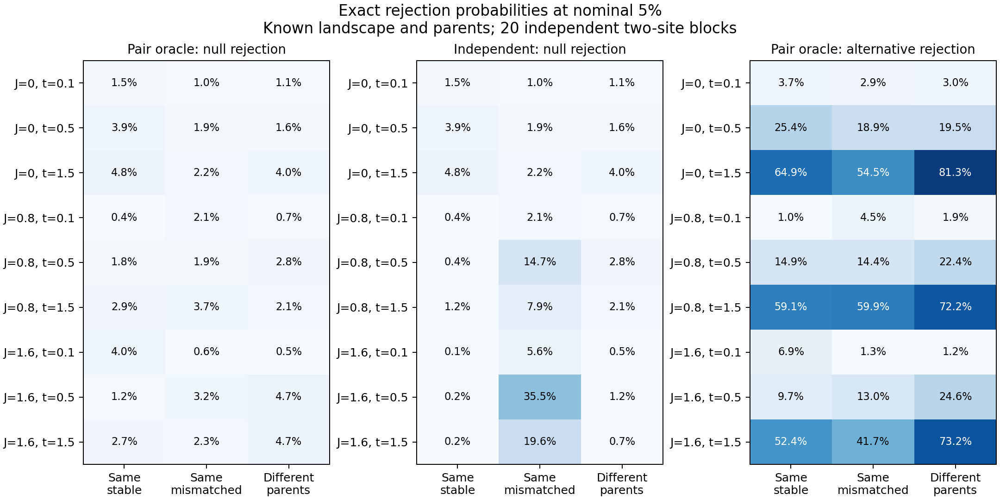

# Residue-pair oracle: first validation milestone

A residue-state-specific pair model recovers endpoint convergence expectations
in this controlled experiment. Across all 27 grid cells and nine categories,
the largest absolute discrepancy from an independently implemented Gillespie
simulation is 2.124 Monte Carlo standard errors. At nominal 5%, the exact
oracle null rejection probabilities are 0.365–4.791%. A baseline given the true
site composition and mean substitution rates exceeds 5% in 5/27 cells, reaching
35.471%. This establishes the known-parameter oracle milestone, not production
omega calibration or efficacy on proteins.



## Model and observation

Two interacting sites have three states each. The fixed landscape is
`F(a,b) = h0[a] + h1[b] + J[a,b]`, with fields `[0,.15,-.1]` and `[-.1,.1,.2]`,
`J = strength * identity(3)`, and mutation rates `[.6,1]`. A single-site move
has rate `mu_site/(K-1) * exp((F_new-F_old)/2)`; other moves have rate zero.
This is a reversible toy mutation-selection CTMC with stationary weights
proportional to `exp(F)`, not a fitted codon model or a uniquely specified
population-genetic fixation law.

The oracle exponentiates the full nine-state generator. Both residues can
change within a branch, so the background is not frozen at its initial state.
Two disjoint branches evolve independently conditional on their known parent
states. We count **net endpoint substitutions**, not hidden recurrent events:
both endpoints must differ from their own parent to contribute at a site.
The nine any/spe/dif categories are derived from the same endpoint pairs.
Thus their nesting and additive identities are preserved.

Each replicate aggregates 20 independent site pairs; dependence within each
pair is retained by exact convolution of its 0/1/2 count PMF. Tests use the
inclusive upper tail of the aggregate `any2spe` count at alpha=.05, with no
randomization at discrete boundaries. Conservative rejection rates are
expected. These are not the production omega statistic or its P-values.

The baseline has zero pair coupling but exactly matches the true stationary
marginal distribution and stationary mean substitution rate at **each** site.
Initial parent states and elapsed branch times are the same in both models;
parents need not be stationary. This controls for marginal preference and rate
heterogeneity but cannot reproduce the conditional dynamics of the pair model.

## Fixed grid and independent check

All combinations are retained: coupling 0/.8/1.6, branch length .1/.5/1.5
(second branch 1.3 times longer), and parents `[[0,0],[0,0]]`, `[[0,1],[0,1]]`,
`[[0,0],[1,0]]`. Each cell has 5,000 null and 5,000 alternative replicates,
each with 20 pairs (100,000 pair draws per distribution per cell).
The seed is 20260911. The Gillespie implementation computes local field and
coupling differences without calling the oracle generator or transition
matrix. Unit tests also check categories against an independent scalar
classification over all 81 parent pairs and all 81 endpoint pairs, detailed
balance, the uncoupled Kronecker limit, and matched baseline moments.

The alternative adds a field of +2 toward state 2 at site 0 on both branches.
Alternative observations never enter construction of the null. Exact oracle
power ranges from 1.023% to 81.282% over the whole grid and exceeds its own
null rejection probability in every cell. It is weak in some conditions:
this is evidence that the procedure can retain a shared directional signal,
not that it has generally sufficient power. At J=1.6, t=1.5 with different
parents, oracle FPR is 4.691% and power is 73.208%.

The largest baseline FPR (35.471%) occurs at J=1.6, t=.5 with same mismatched
parents; oracle FPR there is 3.243%, with power 12.954%. This cell is identified
as the maximum after examining the complete grid, not a representative average.
The baseline is also overly conservative in other cells. Its raw alternative
rejection fractions are included for transparency but are **not** comparisons
at matched FPR. Both methods threshold the same count, so matching their exact
null rejection behavior would remove this threshold-based power distinction.

## Reproduction and remaining work

From the repository root:

```bash
python tools/validate_pair_epistasis.py --replicates 5000 --pairs 20 --seed 20260911 --outdir reports/pair_epistasis_oracle_20260910
python reports/pair_epistasis_oracle_20260910/plot_results.py
python -m pytest -q tests/unit/test_pair_epistasis.py
```

[results.json](results.json) contains all categories, Monte Carlo means and
standard errors, exact rejection probabilities, empirical rejection fractions,
and binomial confidence intervals. [summary.tsv](summary.tsv) is the compact
`any2spe` table. The image shows exact probabilities, not noisy estimates.

The oracle knows both the generating landscape and ancestors. A correct exact
null is calibrated by construction; the independent simulator tests its
implementation, not robustness to misspecification. Generalizing beyond this oracle would require learned parameters, larger state
spaces, interaction networks, phylogenetic dependencies, ASR uncertainty, N/S
normalization and full-pipeline omega calibration. These are limitations, not
remaining deliverables of this task. At the user's direction, external-data
integration is out of scope; this work concludes at the oracle stage.
No production CLI behavior is changed by this research module. The earlier
scalar branch-context correction remains exploratory and off by default.

## Software verification

Python 3.12: full repository suite 1,777 passed, 6 skipped (four require torch,
two require gemmi); strict native extension suite 7 passed. Lint, repository
hygiene, configured type checks, documentation checks including the local Wiki
copy, wheel/sdist build, and Twine checks passed. The extracted sdist ran the
pair-oracle and preceding epistasis validation tests: 18 passed. The wheel
contains the new research module; both validation scripts are included in the
sdist. These checks preceded integration into the main checkout. No push or publication
was performed.
