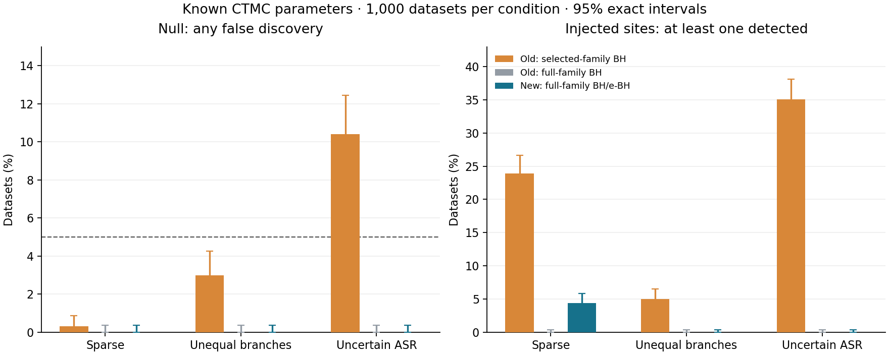

# CSUBST 解析的Pの改善と性能評価（2026-09-10）

[選別後のtrait/match別BHに統一した追加比較](selected_trait_match/COMPARISON.md)も参照。

祖先状態とサイト速度を系統樹全体で積分する、新しい解析的Pを実装した。
候補選別前の全仮説数でBH/e-BH補正する。permutation・bootstrapは使わない。
**既知モデルでの有限標本の妥当性は確認できたが、弱いシグナルには保守的で、
同じ配列から推定したモデルの不確実性は未解決である。** このため既存Pの
無条件な置換ではなく、`--scan_analytic_pvalue endpoint_mixture` による選択式とした。
GeneGalleonの既存の漸近P集約は、この変更だけでは切り替わらない。

[方法・数式・出力仕様](../../docs/SCAN_ANALYTICAL.md)を参照。

## 統計的な変更

- Posterior massを整数Poisson観測として扱わず、観測されたtip配列の尤度を使う。
- 共有祖先による枝の依存と、サイト全体で共有する速度カテゴリーを積分する。
- Foregroundの対象endpointを増やす固定4対立モデル（2/10/100倍、および条件付きendpoint）の尤度を平均し、
  e-value `E=平均対立尤度/帰無尤度`、解析的P `min(1,1/E)` を計算する。
- サイト・trait・状態変化の仮説数を選別前に固定する。出力されなかった仮説も
  P=1として補正対象に残す。このPへのBHはe-BHと同じ棄却を与える。

固定された正しい帰無モデルでは `E0[E]≤1` からPの妥当性が得られ、e-BHは
仮説間の任意の依存に対応する。ただし帰無仮説は「指定したサイト全体の進化モデル」であり、
元のPoisson枝率比較と同じ検定ではない。これは適応進化の証明でもない。
[Wang & Ramdas (2022)](https://academic.oup.com/jrsssb/article/84/3/822/7056146)を参照。

## 帰無分布と検出感度

独立実装の4コドンCTMCで8 tips・12サイトを生成した。3種類の枝長・速度条件、
サイトフィルター有無、帰無のみ／3サイトへのシグナル注入を組み合わせ、
各条件1,000データセット、計12,000回、祖先推定と候補選別をやり直した。
2 traits × 2 match classes、全仮説数は96。乱数seedは51052026。
**Q・枝長・速度分布は既知**であり、IQ-TREEによる推定誤差はこの検証に含めない。

全帰無データで「少なくとも1件の誤検出」が起きた割合（名目5%、フィルターなし）：

| 条件 | 従来P＋選別後のtrait/match別BH | 従来P＋全96仮説BH | 新P＋全96仮説BH/e-BH |
| --- | ---: | ---: | ---: |
| 疎な置換 | 0.3% | 0% | 0% |
| 不均一な枝長 | 3.0% | 0% | 0% |
| 曖昧な祖先・速度混合 | 10.4% | 0% | 0% |

0/1,000の両側95%正確信頼区間は0–0.368%。真の誤検出率がゼロだという主張ではない。
フィルターありでも新方式は各条件0/1,000、従来方式は0.3%、3.0%、10.3%だった。
**誤検出の減少には補正対象の拡大も寄与しており、新P単独の効果とは解釈しない。**
条件間でseedを共有しているため、各条件を独立な6,000試行としてプールしない。

3/12サイトでforeground tip `a,e` をAACに置換した感度評価。
「注入サイトが少なくとも1つ検出された割合」は以下の通り。

| 条件 | 従来P＋選別後BH | 従来P＋全96仮説BH | 新P＋全96仮説BH/e-BH |
| --- | ---: | ---: | ---: |
| 疎な置換 | 23.9% | 0% | 4.4% |
| 不均一な枝長 | 5.0% | 0% | 0% |
| 曖昧な祖先・速度混合 | 35.1% | 0% | 0% |

同じ補正対象では疎な条件で新Pの感度が上がったが、全体として弱いシグナルには低感度。
4.4%の95%区間は3.21–5.86%。新方式の部分対立下での平均FDPは、疎な条件で0.0583%、
他条件で0%だった。これはtip置換による感度対照であり、特定の適応過程に対する一般的検出力ではない。
注入サイトの全仮説を対立サイトとして扱い、未注入サイトでの棄却を誤検出に数えた。



全数列挙の単体検証では、共有祖先・異なる枝長・不変カテゴリーを含む速度混合について、
内部状態と全16 tipパターンを独立計算した。尤度の一致、Eの帰無平均1、
全ての到達可能なP閾値でのsuperuniformityを確認した。
対立倍率の人工的な上限も除去した。長さ1e−8の枝2本で稀なendpointを観測する
単体テストではP<1e−14を確認しており、foregroundが少ない場合も倍率上限による下限はない。

## 実行時間とメモリ

MacOS x86_64、Python 3.10.14、NumPy 1.26.4。拡張モジュールを無効にし、
同じ入力・1スレッド指定・ウォームアップ後、別プロセスで各4回測定した。
以下は4コドン・8 tipsの祖先推定とscanを含み、IQ-TREEによるモデル推定は含まない。
候補数と従来の数値出力が変更前後で一致することをassertで確認した。
新Pそのものは別の統計量であり、従来Pとの数値的一致は要求しない。

| サイト数 | 候補数 | 従来の中央値 | 新P追加の中央値 | プロセス最大RSS：従来→新 |
| --- | ---: | ---: | ---: | ---: |
| 100 | 18 | 0.247秒 | 0.285秒 | 134.0→133.6 MiB |
| 1,000 | 124 | 2.022秒 | 2.203秒 | 142.7→142.4 MiB |

1,000サイト例の時間増加は約9.0%。100サイト例は測定ばらつきが比較的大きい。
RSSの小差はメモリ削減の証拠とは扱わない。全反復値はJSONに保存した。

61コドン・4速度カテゴリー、100候補について、新しい尤度カーネル単体も測定した。
統計シミュレーション終了後、並走させずに各4回再測定した。
Qはκ=2、ω=0.3、等コドン頻度、全枝長0.05。入力生成・モデル生成は時間から除外し、
RSSにはPythonプロセスと入力も含む。

| tips | 100候補の中央値 | プロセス最大RSS |
| --- | ---: | ---: |
| 16 | 0.591秒 | 133.7 MiB |
| 64 | 1.613秒 | 134.4 MiB |
| 256 | 5.675秒 | 137.5 MiB |

64 tipsで、背景AAA・独立foregroundをAACにした固定パターンのK→N対比では、
foreground数2/4/8に対しPは `4.99e-6 / 5.00e-11 / 4.82e-20`。
10,000 OG × 300サイト × 400対比 = 12億仮説で1件だけ検出される例なら、
8 foregroundのBH値は約 `5.78e-11` となる。**これは到達可能なPの例であり、
実際に10,000 OGを解析した性能評価や一般的な検出力の推定ではない。**

## 実装・実データ経路の確認

- 関連hostテスト193件、GeneGalleon Docker内146件が通過。
- Ruffと変更した推論モジュールのMypyが通過。
- IQ-TREE 3.1.4のGY+FQとGY+FQ+G4でCLIを実行し、新P・全仮説数・JSONを確認。
  G4は`--substitution_posterior joint`との併用も確認した。
- G4の全100サイトの帰無log likelihoodは、独立に復元した新カーネルで
  −1826.7349458099109、IQ-TREE報告値は−1826.7349。
  差4.58e−5で、報告丸め精度内で一致した。
- SIF/HPC実行、全リポジトリテスト、推定モデル下のFDR校正、10,000 OG全体の実行は未実施。

## 再現用ファイル

基準commit: `2361ccdfd3c4d29f03b9f60de69db2d0d0f8f466`、本変更は未commit。
主なソースのSHA256は[source_hashes.json](source_hashes.json)。

```bash
CSUBST_DISABLE_EXTENSIONS=1 OPENBLAS_NUM_THREADS=1 OMP_NUM_THREADS=1 \
  python tools/benchmark_scan_analytic.py --outdir NEW_OUTPUT --replicates 1000
CSUBST_DISABLE_EXTENSIONS=1 OPENBLAS_NUM_THREADS=1 OMP_NUM_THREADS=1 \
  python tools/benchmark_scan_analytic_codon.py --output codon_runtime.json
```

- [最終統計比較と前後の時間・RSSの全反復](final/summary.json)
- [61コドンの時間・RSS・固定パターンP](codon_runtime.json)
- [初期測定](summary.json)と[初期対照比較](controlled/summary.json)：最大倍率1,000の試作版。最終方式は条件付きendpoint対立を含む。同じseedを使っており、独立な追加試行として数えない。
- [図のPDF](calibration.pdf)、[再描画スクリプト](plot.py)
- [G4のCLI出力](cli/result-gamma/csubst_scan.tsv)、[モデルと補正対象の記録](cli/result-gamma/csubst_scan_inference.json)
- [IQ-TREEとの尤度比較](cli/likelihood_check.json)、[Dockerテストログ](cli/tests.log)、[hostテストログ](host_tests.log)
