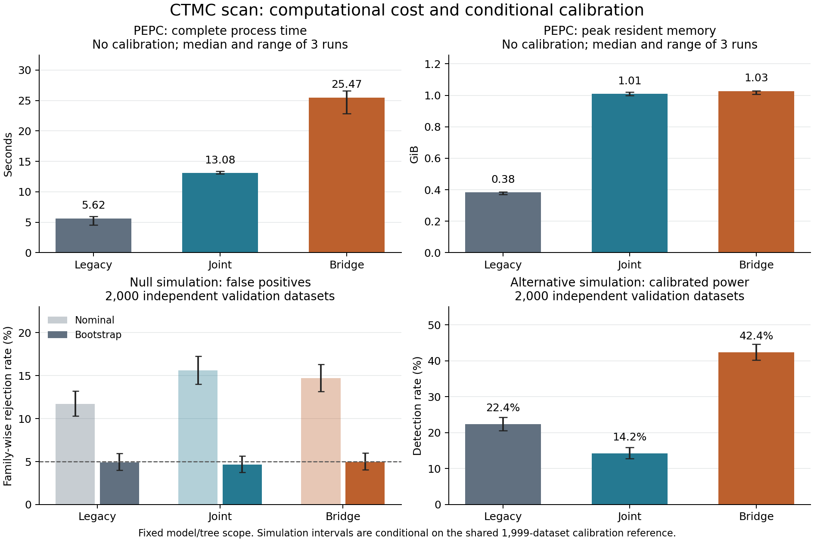

# Joint posterior / CTMC bridge scan comparison — 2026-09-10

True parent–child joint posteriors, posterior mean CTMC jump counts, and a
parametric bootstrap that repeats ancestral inference and candidate selection
are implemented as opt-in scan modes. The original default calculation is
preserved. [Usage and formulas](../../docs/SCAN_CTMC.md).

On PEPC, both new methods retain the same 98 candidates, but change event counts
and scores. Their extra computation and memory are measurable. In a separate
fixed-model simulation, bridge calibration achieves a 4.95% family-wise false
positive rate at alpha 0.05 (95% interval 4.04–5.99%). This is evidence for the
specified conditional model, not a guarantee under model misspecification.



## PEPC: observed scan cost

The workload has 71 tips, 141 nodes, 971 codon sites, and 10 independent
foreground units. All methods reuse exactly the same fitted uniform ECMK07+F
Q/tree and input files. Legacy uses the original marginal-product observations,
Q-weighted exposure and N-rescaled lengths. Joint and bridge reconstruct ASR
from tips and use raw-length endpoint/jump exposure, respectively. These are
different estimands; output equality is not an expected correctness criterion
between the three methods.

One warmup per method is excluded, three measured runs rotate order, and each
runs in a new process with numerical-library thread counts fixed at one. The
reported process wall time includes Python startup and input loading, but
excludes fitting the shared IQ-TREE model. These runs disable calibration.

| Method | Process seconds, median [range] | CLI seconds, median | Peak RSS GiB, median [range] | Candidates |
|---|---:|---:|---:|---:|
| Legacy | 5.62 [4.58–5.96] | 3.32 | 0.383 [0.370–0.387] | 98 |
| Joint | 13.08 [12.94–13.35] | 11.48 | 1.009 [0.998–1.020] | 98 |
| Bridge | 25.47 [22.85–26.61] | 23.07 | 1.027 [1.008–1.030] | 98 |

Relative to legacy, complete process time is 2.33× for joint and 4.54× for
bridge; peak RSS is 2.64× and 2.68×. The scan-score stage itself has medians
1.35 / 1.40 / 1.87 seconds; most extra work is the new inference. The grouped
event tensor and pruning messages are resident in memory. No complete
branch × site × codon-pair tensor is retained.

All measured repeats produce identical result tables within each method.
The legacy result also matches the earlier implementation exactly in all
98 rows and 97 existing columns ([parity check](legacy_parity.json)).
Nominal-P rank correlations with legacy are 0.957 (joint) and 0.953 (bridge).
Nominal P < 0.05 occurs in 55 / 80 / 82 rows; these are selected, dependent,
uncalibrated scores and must not be read as validated discoveries.

[Raw measurements and input hashes](performance_none.json),
[legacy table](legacy_default_none.tsv), [joint table](joint_none.tsv),
[bridge table](bridge_none.tsv).

## PEPC: calibration workload and memory control

A second benchmark uses three calibration replicates per CLI call, again with
an excluded warmup and three measured runs per method. Legacy uses `full_scan`
foreground-label permutations; joint and bridge use `parametric` simulation
with ASR and candidate discovery repeated in every replicate. They have the
same number of iterations but perform different statistical procedures.
Three replicates are solely a timing/memory workload: minimal P = 0.25.

| Method | Process seconds, median [range] | Peak RSS GiB, median [range] |
|---|---:|---:|
| Legacy full_scan | 11.73 [11.36–12.96] | 0.402 [0.392–0.408] |
| Joint parametric | 59.29 [59.00–60.78] | 1.639 [1.630–1.675] |
| Bridge parametric | 134.30 [120.99–137.80] | 1.658 [1.646–1.685] |

The host is an Apple M2 Max (12 physical cores, 64 GiB RAM). Unrelated CPU-heavy
workloads were active during this later phase. Absolute times are therefore
host-load dependent; do not subtract the uncalibrated-run times to extrapolate
a precise per-replicate cost. Each method was still interleaved with the others
within this phase. No speedup claim is made for the memory cleanup below.

Previously, the preceding bootstrap tensor remained referenced while the next
one was constructed. Releasing it at the end of each replicate lowered median
peak RSS from 2.039 to 1.639 GiB for joint and 2.121 to 1.658 GiB for bridge
(19.6% and 21.8% reductions). All output tables match exactly before and after
this change. A weak-reference regression test verifies that the previous
replicate tensor is released before the next inference begins.

[Final calibration measurements](performance_pipeline.json),
[measurements before release correction](performance_pipeline_before_release.json),
[legacy](legacy_default_pipeline.tsv), [joint](joint_pipeline.tsv), and
[bridge](bridge_pipeline.tsv) result tables.

## Calibration, false positives and power

The main validation uses a two-state CTMC with Q = [[−1,1],[1,−1]], stationary
root frequencies 1/2, eight independent foreground tips with paired background
tips (25 nodes), eight sites, and uniform rates. Stem lengths are 0.12 and
paired terminal lengths are 0.12, 0.14, …, 0.26. Candidate selection uses
`any2spe`, event threshold 0.5 and support from at least three foreground units.

Full continuous-time histories are simulated, then hidden. Every dataset is
reanalyzed from its tips using pruning and the production scan's candidate
extraction, foreground support and rate-statistic code. The global minimum
nominal P includes all selected sites and state changes; an empty selection
contributes one. Independently seeded samples comprise 1,999 calibration
alignments, 2,000 null validations, and 2,000 alternatives. The alternative
multiplies the 0→1 rate by 30 on foreground terminal branches only.

For a controlled comparison, the same global min-P bootstrap procedure is
applied offline to every observation method, including legacy. Thus the
bootstrap columns below are **not** a test of legacy foreground-label
permutations. The legacy-default column recomputes N-rescaled lengths from its
marginal event tensor on each simulated alignment. The extra marginal/raw row
isolates the effect of the observation approximation from N rescaling.

| Observation / exposure | Uncalibrated family-wise false positives | Bootstrap false positives [95% interval] | Bootstrap power [95% interval] |
|---|---:|---:|---:|
| Legacy marginal / N-rescaled Q | 11.70% | 4.90% [4.00–5.94] | 22.35% [20.54–24.24] |
| Marginal / raw Q | 14.45% | 4.80% [3.91–5.83] | 12.35% [10.94–13.87] |
| Joint / endpoint | 15.60% | 4.65% [3.77–5.67] | 14.25% [12.75–15.86] |
| Bridge / integrated jumps | 14.70% | 4.95% [4.04–5.99] | 42.40% [40.22–44.60] |

Intervals are exact binomial intervals for the independent validation sample,
conditional on the shared calibration reference. They do not include the
additional uncertainty of that finite reference. Seeds are 89001 / 89002 /
89003 for calibration / null / alternative. A smaller pilot had appreciable
calibration-reference uncertainty, so the main experiment increased both
reference and validation sizes without changing seeds.

Joint inference is mathematically correct for **endpoint events**, but this
does not guarantee more power for a rate score: in this alternative its power
is below legacy-default. Bridge is best in this specified short-branch
experiment. None of these measurements establishes performance for all
alternatives or fitted codon-model errors.

[Main simulation results, including every minimum score](accuracy_short.json).

## Accuracy of inferred substitution counts

RMSE compares each branch/site/direction posterior estimate with the full
simulated jump history, including repeated and return jumps. Endpoint and
marginal methods inherently omit hidden jumps; this comparison measures that
limitation rather than an endpoint-calculation error.

| Workload | Legacy marginal RMSE | Joint endpoint RMSE | Bridge count RMSE |
|---|---:|---:|---:|
| Main short-branch null, 2,000 alignments | 0.19298 | 0.19261 | 0.19199 |
| Long branches, four tips / seven nodes, 200 alignments | 0.63404 | 0.63840 | 0.57316 |

The long-branch workload uses length one on every edge, eight sites, and two
foreground tips. Bridge reduces jump-count RMSE by 9.60% relative to legacy.
This long-branch experiment is primarily a hidden-jump check: joint and bridge
have zero detections among its 200 null and 200 alternative alignments under
the configured support rule; better count estimation does not ensure useful
rate-test power. The long-branch legacy-default bootstrap has 5.5% null
rejections and 8.5% power, with only 199 calibration alignments.

[Long-branch simulation results](accuracy_long.json).

## Independent comparison with IQ-TREE ASR

The pruning implementation was also checked against 55,053 nonmissing
node/site rows from 69 non-root internal nodes in the archived PEPC ASR fit.
The initial comparison revealed two differences in inputs, rather than a
branch-time or message-passing error:

- IQ-TREE treats a codon containing an ambiguous nucleotide as wholly unknown;
  the new modes retain the remaining partial codon information. This is a
  deliberate observation-model difference. It can change individual
  posteriors substantially (maximum absolute difference 0.7973 in this fit).
  [IQ-TREE's codon input specification](https://iqtree.github.io/doc/Tutorial#using-codon-models).
- The archived `.iqtree` file prints equilibrium frequencies to four decimal
  places. With matching unknown-codon handling but this rounded Q, the maximum
  posterior discrepancy is 0.01018. Recovering the full empirical +F
  frequencies from resolved codon counts for this **verification only** reduces
  the maximum discrepancy against raw five-decimal `.state` values to
  5.00002e-6, their printing precision (plus negligible tree/float rounding).

This independently verifies the pruning calculation and codon-model time
scale. Production calculations and the benchmarks above deliberately use the
same existing parsed Q for all exposure methods. Their posteriors are exact
for that supplied generator and the declared emissions, not necessarily equal
to IQ-TREE output generated with different ambiguity handling and unrounded
parameters. Real-data differences should therefore not all be attributed to
marginal-product versus joint inference alone; the fully resolved two-state
experiments isolate those comparisons more directly.

Normalizing the printed `.state` rows redistributes text-rounding error; the
unrounded-model comparison to those normalized rows has maximum discrepancy
7.23e-5. The [raw comparison record](asr_comparison.json) retains both references
and all changed-site diagnostics. The original default is untouched.

## Correctness and scope

The complete test suite passed **1,791 tests**, with five optional-dependency
skips (three require newer Torch; two require Gemmi). Lint, repository hygiene,
documentation checks and the required type checks passed
([verification record](verification.json)). External Wiki pages were not checked.

Independent checks cover exhaustive ancestral-state enumeration for joint
posteriors, direct numerical quadrature for bridge integrals, reversible
asymmetric generators, direct Frechet versus spectral evaluation, short/zero/
long branches, intermediate/return jumps, synonymous summaries, missing data,
partial-ambiguity replay, and threshold/plot values above one. A test traces
one observed scan plus every simulated ASR-and-discovery rerun. PEPC joint and
bridge CLI smoke runs each complete one parametric replicate, including its
partial IUPAC ambiguity. Those one-replicate runs are functionality checks,
not significance estimates.

The implementation is conditional on a fixed fitted uniform codon Q/tree.
It does not refit the model, rate parameters, topology or branch lengths within
each bootstrap sample. It supports a declared nucleotide-coarsening model for
IUPAC ambiguity. It rejects rate mixtures, native 3Di, nonuniform ambiguity
likelihoods and data-dependent invariant-site filtering that would otherwise
need replay. The main calibration experiment is a controlled two-state
process, not a broad codon-model misspecification study. Parametric replicates
are serial.

## Reproduce

From the repository root, using a Python environment with CSUBST's dependencies:

```bash
python .github/scripts/scan_ctmc_benchmark.py \
  --fit-dir /tmp/pepc-uniform-fit --outdir /tmp/ctmc-none --repeats 3
python .github/scripts/scan_ctmc_benchmark.py \
  --fit-dir /tmp/pepc-uniform-fit --outdir /tmp/ctmc-calibration \
  --repeats 3 --calibration pipeline --niter 3
python .github/scripts/scan_ctmc_accuracy.py --out /tmp/ctmc-short.json
python .github/scripts/scan_ctmc_accuracy.py --out /tmp/ctmc-long.json \
  --train 199 --validate 200 --pairs 2 --tip-length 1 --length-step 0 \
  --stem-length 1 --min-support 2 --alt-factor 8
python .github/scripts/scan_ctmc_check_fit.py \
  --fit-dir /tmp/pepc-uniform-fit --outdir /tmp/ctmc-fit-check
python .github/scripts/scan_ctmc_plot.py \
  --performance /tmp/ctmc-none/performance.json --accuracy /tmp/ctmc-short.json \
  --out /tmp/ctmc-comparison.png
```

Prepare the uniform PEPC fit using the example in
[SCAN_CTMC.md](../../docs/SCAN_CTMC.md), optionally disabling calibration for
that initial run. Measurements were made in the provided local Python 3.10
environment; exact platform, package versions, commands, thread limits and
input SHA-256 hashes are recorded in the measurement JSON. No commit or push
was made.
