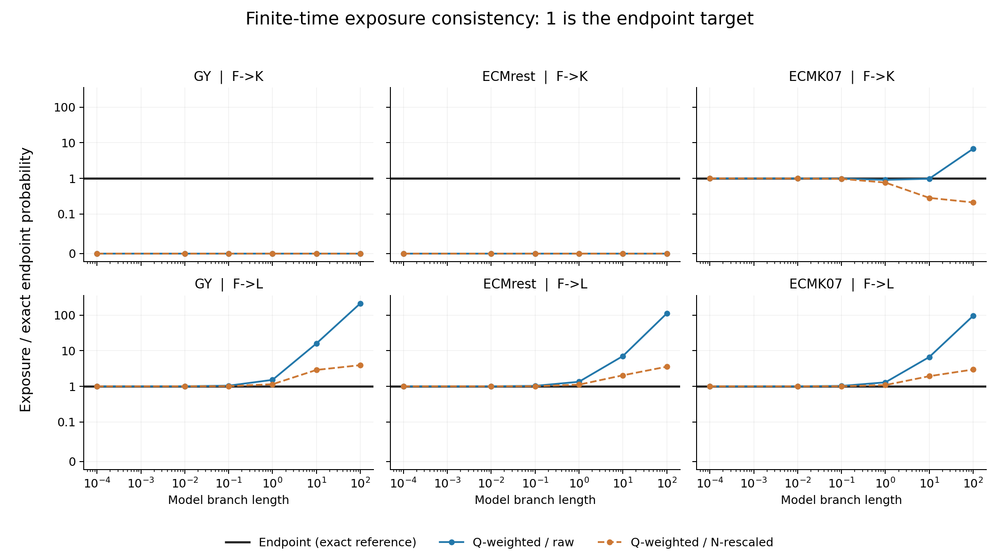
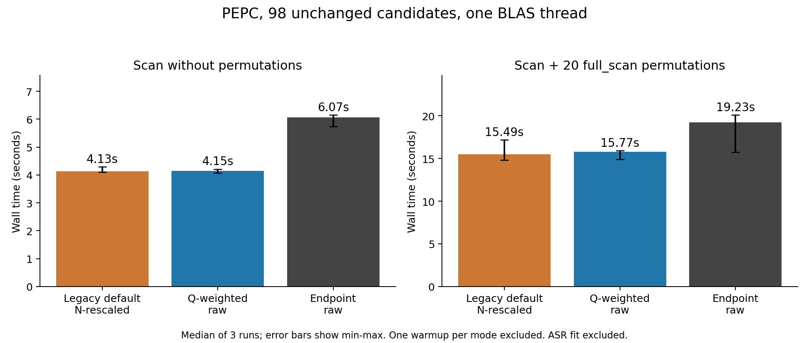

# scan endpoint方式の実装と新旧比較

2026-09-10。基準コミット `c4e6d821f4be43f15bac9bc7b96e98dc3d5ec25d`。
元タスクのディレクトリは読み取り専用で参照し、変更は
この作業用worktreeに限定した。commit・pushは行っていない。

**瞬間Qがゼロでも多段階経路で成立する端点変化に、正の期待量を与える
endpoint方式を実装した。PEPCの候補・支持・観測量を保ったまま分母を変更できたが、
実行時間は増加した。P値の較正や検出力の改善を実証した結果ではない。**

## 実装範囲

```text
--scan_rate_exposure endpoint --scan_rate_length raw
```

- 完全なコドンQを指数化してから出力状態へ集約する。枝長を二重に掛けない。
- GY／MG／ECMrest／ECMK07の均一率モデル、`posterior_sum`を対象とする。
  N/SN再尺度化枝長、率混合、called観測、3Diとの組合せは明示的に拒否する。
- 既定の`q_weighted`は保持。既存統計列が変更前の出力と完全一致することを確認。
- 遷移確率は異なる枝長ごとに一度計算し、候補・サイト・permutationで再利用する。
  大きい配列は既存のworker用memmap経路で共有する。
- 観測と期待の両側で扱える枝・サイトだけを期待量へ含める。ゼロ機会量の原因を
  欠損、ゼロモデル枝長、親の候補状態質量ゼロ、到達不能、数値的ゼロに分ける。
- 正の観測とゼロ期待値の組合せは枝単位で検出し、集計で隠さない。
  permutation内の未定義統計量を「候補なし、最小P=1」と同一視しない。
- `target_exposure`／`other_exposure`、単位、モデル、観測近似、推論方法、
  診断を出力する。endpointの旧`*_exposure_branch_length`欄は未定義とする。

設定、式、出力列、実行例は[利用ガイド](../../docs/SCAN_ENDPOINT.md)に記載した。
主な変更は[scan_endpoint.py](../../csubst/scan_endpoint.py)、
[substitution_scan.py](../../csubst/substitution_scan.py)、CLIと関連文書・テスト。

## 数値・科学的な比較

標準61コドン・一様頻度。GYはκ=2、ω=0.3。親コドンTTTからF→Kの
端点変化を評価した。以下はモデル枝長10での一枝あたり期待量。
旧N方式の枝長には、非同義端点変化数／サイト数の理論平均を使った。

| モデル | 旧Q×raw枝長 | 旧Q割合×N枝長 | 新endpoint | 20万endpoint標本の観測割合 |
|---|---:|---:|---:|---:|
| GY | 0 | 0 | 0.0217171 | 0.021660 |
| ECMrest | 0 | 0 | 0.0143173 | 0.014155 |
| ECMK07 | 0.0222712 | 0.0064523 | 0.0227723 | 0.022325 |

ECMrestは単塩基瞬間遷移に制限される。ECMK07とは分けて検証した。
枝長0.0001～100、F→KとF→Lの36条件で、実装結果を独立の完全コドン
行列指数・明示的な状態対の和と照合した。全条件で数値一致した。
既知の親状態からのmultinomial標本は期待値の確認用で、ASR・候補選択・
P値の較正を再現するシミュレーションではない。



図の1が端点方式の目標。0は真のゼロexposureとして表示した。
縦軸はゼロを含むsymlog。ECMのF→Kでは旧raw方式との差が小さい条件もあるが、
GY／ECMrestの直接Qゼロや、長枝F→Lの不整合は残る。

[数値データ](accuracy.tsv)と[再現スクリプト](../../.github/scripts/scan_endpoint_accuracy.py)。

## PEPCの観測・順位比較

同一の均一ECMK07+F fit、141ノード、解析対象971コドンサイト、10前景単位。
既存の混合率ECMK07+F+R4 fitを均一率として流用せず、新たにfitした。

| 方式 | 候補数 | 観測イベント量・支持 | 旧既定との解析的P順位相関 | rate ratio中央値 |
|---|---:|---|---:|---:|
| 旧既定：q_weighted + n_rescaled | 98 | 同一 | 1 | 6.1703 |
| q_weighted + raw | 98 | 同一 | 0.98064 | 11.9144 |
| endpoint + raw | 98 | 同一 | 0.97696 | 10.8867 |

Q-weighted+rawとendpoint間の順位相関は0.99529。既定との比較では枝長尺度も
変わるため、raw同士の比較を併記した。endpointでは有限時間確率に加えて、
欠損枝・サイトの除外と親posteriorの丸め誤差正規化も適用される。
この比較だけから個々の差を一つの要因に帰属させない。

全98候補の新方式の`rate_status`は`ok`。各方式・各反復で
full_scan 20回は20成功・0失敗だった。nominal q<0.05の件数は旧既定38、
Q-weighted+raw 73、endpoint 72だが、これを感度向上や真陽性数とは解釈しない。

## 実行時間とメモリ

Apple M2 Max / RAM 64 GiB、macOS 26.6.2、x86_64 Python 3.10.14、
NumPy 1.26.4、SciPy 1.15.2。各方式のwarmup 1回を除外後、順序を入れ替えて
3回ずつ測定。新しいprocessでpeak RSSを測り、起動前からBLAS/OpenMPを
1スレッドに固定した。ASR fitの時間は除外し、入力読込・scan・出力を含めた。

| 負荷 | 旧既定 秒：中央値［最小–最大］ | Q-weighted+raw 秒 | endpoint 秒 |
|---|---:|---:|---:|
| permutationなし | 4.13［4.10–4.30］ | 4.15［4.07–4.21］ | 6.07［5.74–6.16］ |
| full_scan 20回 | 15.49［14.82–17.17］ | 15.77［14.90–15.92］ | 19.23［15.73–20.11］ |

旧既定に対する時間増加の中央値は約47%／24%。full_scanの範囲は重なるため、
24%という値を安定した一般的な倍率とは扱わない。実データ一件の測定であり、
異なる状態数・配列長・枝数・候補数・OS・BLASへの外挿はしない。
プロファイルでは追加コストの大部分が枝ごとの行列指数の準備だった。

peak RSSの中央値（MiB）は、permutationなしで旧既定371.1、新方式357.8、
full_scanで旧既定394.9、新方式406.5。プロセス全体のピークで測定変動があり、
一貫したメモリ削減とは主張しない。



変更前に別途測った旧CLI 3回の中央値は4.11秒。
比較器の読み込み順によりBLAS設定が揃わなかった予備測定は採用していない。
上表・保存JSONは起動前の環境変数を固定した再測定結果のみを使った。

- [通常scanの記録](performance_none.json)、[full_scanの記録](performance_full.json)：
  各反復、コマンド、入力SHA-256、時間、RSSを含む。リポジトリ内の入力パスは
  リポジトリrootからの相対パスで保存した。
- [変更前測定](baseline_before_edit.json)、[環境・既存列一致確認](verification.json)。
- [通常scan新出力](endpoint_none.tsv)、[旧既定](legacy_default_none.tsv)、
  [旧raw](q_raw_none.tsv)。full_scan出力も同じ命名で保存。

再現コマンド：利用ガイドの例で均一fitを作成した後、

```bash
python .github/scripts/scan_endpoint_benchmark.py \
  --fit-dir /tmp/pepc-uniform-fit --outdir /tmp/scan-none --repeats 3
python .github/scripts/scan_endpoint_benchmark.py \
  --fit-dir /tmp/pepc-uniform-fit --outdir /tmp/scan-full \
  --repeats 3 --calibration full_scan --niter 20
python .github/scripts/scan_endpoint_accuracy.py --outdir /tmp/scan-accuracy
```

20反復は性能測定用であり、低い有意水準の較正試験には不足する。

## 検証と残る範囲

- 全体：`make test`の非process群1771 passed / 5 skipped、process群4 passed。
  合計1775 passed / 5 skipped。PyTorch 2.2.2に対する>=2.6制約で3件、
  gemmi未導入で2件がスキップ。既存のrequests依存関係警告あり。
- `make lint`（hygiene・文書検査を含む）、`make typecheck`成功。
  元Pythonにpytest-xdistがなかったため、全体テストは同じPython・既存依存を
  引き継ぐ一時venvにxdistを追加して実行した。製品依存は変更していない。
- 短枝・長枝、同義／同グループ除外、GY/MG/ECM、コドン順序変更、
  ゼロ枝・欠損・到達不能、invalid Q、未対応設定、dense/sparse、
  単独／並列candidate_fixed/full_scanを回帰テストした。
- 変更前の既存統計列、新旧の候補・観測量・支持数、各方式の反復出力は
  浮動小数点の許容差を使わず一致確認した（設定seed・指定反復数の差を除く）。
- 図は描画後に視覚確認した。

この段階で完了したのは、ID 7の有限時間分母の実装と数値・実行性能比較。
ID 8の真のjoint posterior、CTMC bridgeの履歴カウント、率混合、native 3Diの
endpoint context、ASR・候補抽出を含むFPR/FWER較正は未実装・未検証である。
P値・q値は引き続き探索的指標として扱う。
