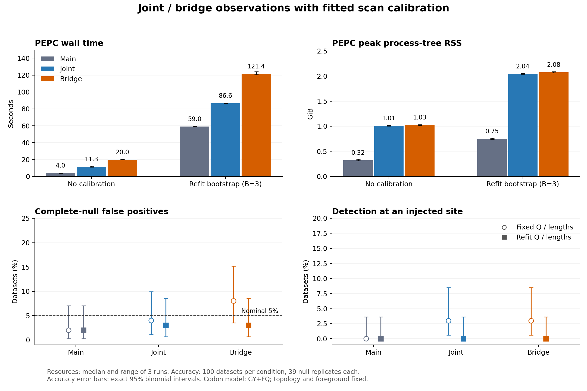

# Scan integration: joint/bridge observations and fitted bootstrap

This comparison integrates the scan calibration and endpoint-related main commits
through `2361ccd` with the joint/bridge scan work. The reference source is an
unchanged archive of `2361ccd`; the production checkout was not modified.

**Result:** integrating the fitted bootstrap improves the scope of calibration,
but does not demonstrate better detection in this experiment. Bridge reduces
jump-count RMSE by about 11%; with refitting all three methods detect 0/100
injected-signal datasets. Joint and bridge take 1.47× and 2.06× main's time and
about 2.7× its peak process-tree RSS. The marginal default is retained.



## Matched resource results

| Observation | No calibration, seconds | Refit B=3, seconds | No calibration, GiB | Refit B=3, GiB |
|---|---:|---:|---:|---:|
| Main marginal | 4.03 | 59.05 | 0.323 | 0.751 |
| Joint | 11.33 | 86.58 | 1.013 | 2.042 |
| Bridge | 19.99 | 121.45 | 1.027 | 2.079 |

Values are medians of three measured repetitions. Relative to main with the
same refitted calibration, joint takes 1.47 times as long and 2.72 times the
peak process-tree RSS; bridge takes 2.06 times as long and 2.77 times the RSS.
These are additional observation models, not runtime or memory improvements.

## Accuracy results and interpretation

Each percentage below has denominator 100 independent observed datasets.
Parentheses are exact 95% binomial intervals. The per-dataset bootstrap has 39
replicates and 0.025 P-value resolution; the scan-wide threshold is 0.05.

| Calibration | Observation | Complete-null false positive | Detection at an injected site | Any rejection under alternative | Background detection under alternative |
|---|---|---:|---:|---:|---:|
| fixed | marginal | 2% (0.2–7.0%) | 0% (0.0–3.6%) | 4% (1.1–9.9%) | 4% (1.1–9.9%) |
| fixed | joint | 4% (1.1–9.9%) | 3% (0.6–8.5%) | 4% (1.1–9.9%) | 2% (0.2–7.0%) |
| fixed | bridge | 8% (3.5–15.2%) | 3% (0.6–8.5%) | 5% (1.6–11.3%) | 3% (0.6–8.5%) |
| refit | marginal | 2% (0.2–7.0%) | 0% (0.0–3.6%) | 3% (0.6–8.5%) | 3% (0.6–8.5%) |
| refit | joint | 3% (0.6–8.5%) | 0% (0.0–3.6%) | 0% (0.0–3.6%) | 0% (0.0–3.6%) |
| refit | bridge | 3% (0.6–8.5%) | 0% (0.0–3.6%) | 0% (0.0–3.6%) | 0% (0.0–3.6%) |

Signal and background detections can coexist in a dataset, so their counts do
not necessarily sum to the number with any rejection.

Refitted calibration gives false-positive estimates of 2%, 3%, and 3% for
marginal, joint, and bridge. Every interval includes nominal 5%; this finite
experiment is consistent with nominal control but does not establish universal
calibration. Bridge changes from 8% with the fixed model to 3% with refitting;
the paired exploratory exact test gives P=0.0625, so this sample does not
establish the reduction at the 5% level.

All three refitted methods detect an injected site in **0/100** alternative
datasets (95% interval 0–3.6%). Fixed-model joint and bridge detect 3/100, versus
0/100 for marginal; those paired differences are also inconclusive (P=0.25).
Thus the intended improvement in detection is **not demonstrated**. A factor-12
rate change in this specific eight-tip/80-site experiment does not translate
into useful power for these scan settings. No stronger alternative or threshold
was substituted after observing this result.

### Accuracy of estimated nonsynonymous jump counts

RMSE is per branch/site, against the full simulated nonsynonymous jump count.
It describes observation accuracy and is the same for both calibration choices.
Endpoint observations and bridge counts have different estimands; this metric
specifically evaluates suitability for estimating total jump counts.

| Scenario | Observation | All non-root branches | Excluding root-adjacent edges |
|---|---|---:|---:|
| Null | marginal | 0.28159 | 0.27052 |
| Null | joint | 0.26798 | 0.26802 |
| Null | bridge | 0.25030 | 0.24745 |
| Alternative | marginal | 0.29047 | 0.27875 |
| Alternative | joint | 0.27630 | 0.27621 |
| Alternative | bridge | 0.25790 | 0.25471 |

Bridge lowers RMSE by 11.1% under the null and 11.2% under the alternative
relative to marginal. Excluding the two root-adjacent edges still gives 8.5%
and 8.6% reductions. Joint lowers all-branch RMSE by about 4.8–4.9%, but only
about 0.9% after excluding those edges. These are measured point differences;
no claim of universal superiority follows from this generating model.

The practical result is to keep the marginal default and expose joint/bridge
as explicit observation choices. Bridge improves estimation of total jump
counts here, but neither added mode has demonstrated a detection benefit that
justifies making its extra runtime and RAM the default. Refitted calibration
remains the applicable option when fitted parameters must be included in the
null procedure.

## Design

- Baseline: marginal-product observations, Q-weighted exposure, N-rescaled lengths.
- Joint: true parent/child posterior endpoint events and finite-time endpoint exposure.
- Bridge: posterior mean CTMC jump counts and integrated jump-count exposure.
- Fitted calibration: all modes use the same fitted-null generator, simulate new
  alignments, refit IQ-TREE parameters/branch lengths, redo ASR and candidate
  selection, and compare the same stable maximum score.
- Fixed-model comparison: hold Q/lengths fixed, simulate tips and recompute ASR
  and candidate selection; no parameter/length refitting.

Topology, root, foreground labels and model family remain fixed. This does not
validate topology/model selection or robustness to model misspecification.

## Workloads

The PEPC benchmark contains 71 tips, 141 nodes and 971 codon sites, with ten
independent foreground units. It uses GY+FQ for all methods. To meet the fitted
bootstrap observation contract, all non-ACGT codons are represented as completely
missing; 39 partially ambiguous codons are affected beyond already fully missing
entries. The same masked alignment and initial fit are used in every mode.
The earlier ECMK07+F timing report is not a matched baseline for this experiment.

The resource benchmark excludes one warmup per configuration and rotates three
measured repetitions. Bootstrap B=3 measures runtime only; its P-value resolution
is insufficient for a 5% significance analysis. Peak RAM is the summed RSS of
simultaneously live processes, including bootstrap children and IQ-TREE, sampled
at 20 ms. Shared pages can be counted more than once; this is not unique physical
memory. The host is an M2 Max, with x86_64 Python 3.10 under translation, NumPy
1.26.4, SciPy 1.15.2 and IQ-TREE 2.3.6. Other host work was active (one sampled
load average was about 8.7); repeated timings and ranges must be read in that
context. The new accuracy validation is run after the resource benchmark.

Nested calibration validation uses an eight-tip, 80-site GY+FQ process. Each
independently simulated observed dataset gets its own fitted model and its own
39-dataset bootstrap reference. There are 100 complete-null and 100 alternative
datasets. The alternative increases entry rates into lysine codons by a factor
of 12 on two foreground tips at eight sites. All observation methods share
simulated alignments and each IQ-TREE refit. Fixed and refitted analyses use the
same null draws. The validation harness calls the production model reader,
ASR loader, candidate selection and score functions; its results are checked
against the full CLI. IQ-TREE uses one fixed thread to avoid AUTO tuning overhead.

For the fixed-model marginal comparison, ASR is recomputed at full precision;
the refitted marginal comparison uses the five-decimal IQ-TREE state output,
matching the main CLI. Thus that particular fixed/refit contrast includes ASR
serialization as well as refitting. Joint and bridge recompute exact pruning
in both cases. GY+FQ keeps stationary codon frequencies uniform; kappa, omega
and branch lengths are refitted.

Complete-null false-positive rates and alternative rejection rates are reported
with exact binomial intervals. Detection at an injected site is distinguished
from any rejection and from false localization outside the injected sites.
Observed alignments are generated by exact CTMC jump simulation, retaining all
nonsynonymous jump counts. Count RMSE compares posterior estimates with the
true total nonsynonymous count per branch/site, with a separate calculation
excluding the two root-adjacent edges. These operating characteristics apply
to this generating model and signal.

## Implementation checks

The integrated default marginal scan exactly reproduces all 100 pre-existing
result columns across 103 candidates from `2361ccd`, both without calibration
and with refit B=3 (excluding the run-directory path column). All six measured
configurations produce identical result tables over the three repetitions.
All 3,600 global and localized P values from the 200-dataset accuracy experiment
were independently checked against their complete 39-replicate references.
All six latest-code CLI comparisons against the accuracy harness passed.
All nine saved bootstrap P-value vectors were independently recomputed from
saved null maximum scores. Q, stationary frequencies, tree and all three null
alignments agree across modes. The PEPC fitted log likelihood is
-61710.624348 as reported by IQ-TREE and -61710.62434784959 by exact pruning.

The regular and process test suites passed 2,076 tests, with five skips
(three require newer PyTorch; two require gemmi). Native tests are included.
Repository type checks and the four scan model/calibration modules pass.
A subsequent type annotation cleanup passed all 17 CTMC integration tests.

## Reproduction and artifacts

Run from the repository root with the documented dependencies and a compatible
IQ-TREE executable on PATH. The benchmark reference directory must contain an
unchanged checkout/archive of `2361ccd` with its native extensions built.
The [saved PEPC fit](PEPC.fit.tar.gz) contains the actual initial IQ-TREE files;
user-home prefixes in text provenance are normalized to `${HOME}`. Extract
them and provide explicit IQ-TREE paths when reusing them outside their original
cache directory. Alternatively, fit the saved [masked PEPC alignment](PEPC.masked.fa)
with GY+FQ and the repository PEPC tree; pass the resulting IQ-TREE directory
as FIT below. The per-run CLI
commands are retained in [benchmark.json](benchmark.json).

```sh
python .github/scripts/scan_integration_benchmark.py \
  --baseline BASELINE --alignment reports/scan_integration_20260910/PEPC.masked.fa \
  --fit FIT --outdir BENCHMARK --repeats 3 --niter 3
python .github/scripts/scan_integration_accuracy.py \
  --outdir ACCURACY --datasets 100 --replicates 39 --workers 4 \
  --seed 19092026 --sites 80 --signal-sites 8 --factor 12
python .github/scripts/scan_integration_accuracy.py \
  --outdir ACCURACY --verify-pilot ACCURACY
python .github/scripts/scan_integration_plot.py \
  --benchmark BENCHMARK/benchmark.json --accuracy ACCURACY/summary.json \
  --out reports/scan_integration_20260910/comparison.png
```

The accuracy experiment uses 8,000 IQ-TREE fits plus the initial generating fit.
The first null and alternative cases are also checked against all three full
CLI modes. This validation does not silently omit failed fits or retune the
simulation after seeing results.


Machine-readable artifacts: [resource summary](benchmark_summary.json),
[resource and compatibility checks](verification.json),
[accuracy summary](accuracy_summary.json), [experiment metadata](accuracy_metadata.json),
[all 200 raw score/reference records](accuracy_records.json.gz),
[independent P-value audit and paired comparisons](accuracy_audit.json), and
[full CLI checks](cli_verification.json). Test and type-check logs are saved
beside this report. Paired tests are exploratory and not adjusted for multiple
comparisons. Repository documentation and hygiene checks pass; external Wiki
links were not checked because no Wiki checkout was supplied.
